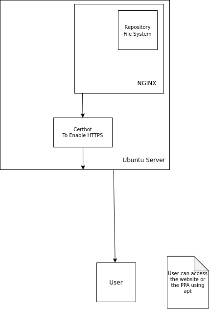

# Tuffix Website

This is the landing page for the Tuffix project presented by California State University Fullerton.
Tuffix can be viewed as either an `apt` package or a Python module.
Both will accomplish the same goal.

## PPA

This repository contains the PPA backend file system.
It can be cloned on a remote Linux server and use `nginx` to host the files.
Typically you would place the **root** of the repository where `nginx` defaults to, which is `/var/www/html` for Ubuntu.
The following diagram explains this:



Another thing to note is we also want to enable `https` for obvious reasons.
One way we can do this is by using `cerbot`, a free SSL signing service that will use our domain and in this case it `tuffix.xyz`.

Pros:
- Integration with `apt`
- Allows us to have a website alongside the PPA

Cons:
- Requires `ssl` signing services that are only valid in three month increments
- Requires a valid domain to be in use

## Python Module

**NOTE:** I personally recommend using this approach in migration efforts during the middle of the semester when it is unlikely that people will be accessing the PPA.

Another way to install `tuffix` on your computer is to install it as a Python module.
This can be done by running the following command in the terminal:

```bash
sudo pip3 install git+https://git@github.com/CSUF-Tuffix/Tuffix-2.git@master
```

You would then be able to use the command `tuffix`, system wide as if you installed it using the PPA.

Pros:
- Easy and efficient, cuts out on the middle man of a PPA
- Does exactly what the PPA does

Cons:
- Not a one click install

# Sources

- [Setting up the webserver](https://www.youtube.com/watch?v=OWAqilIVNgE&t=914s)
- [Setting up PHP](https://devanswers.co/install-php-nginx-ubuntu-20-04/)
